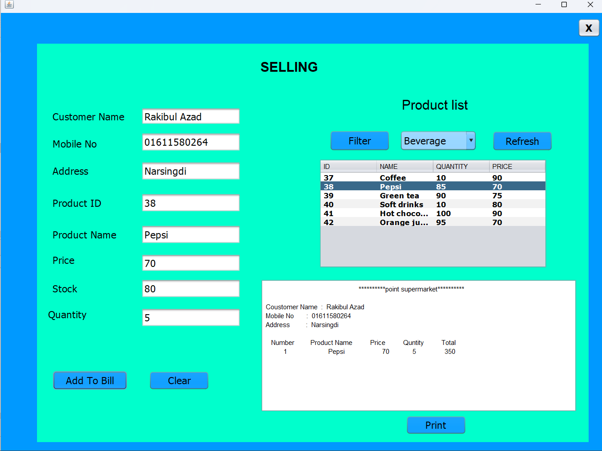

# Super Market Management System

## 🚀 Project Overview
The **Super Market Management System** is a Java-based desktop application designed to efficiently manage supermarket operations, including inventory, billing, and customer transactions. It provides an interactive user interface using **Java Swing** and **JFrame**, while **MySQL** is used for database management.

## 🛠️ Technologies Used
- **Java** - Core programming language
- **Java Swing** - GUI development
- **JFrame** - Window-based application framework
- **MySQL** - Database management

## 📌 Features
- **User Authentication** (Admin, Staff, Cashiers)
- **Inventory Management** (Add, Update, Delete Products)
- **Billing System** (Generate and Print Bills)
- **Customer Management**
- **Sales Reports & Analytics**
- **Multi-User Access**

## 🔧 Installation Steps
1. Clone the repository:
   ```sh
   git clone https://github.com/YourUsername/SuperMarket-Management
   ```
2. Open the project in **NetBeans** or **Eclipse**.
3. Set up the database:
   - Open **phpMyAdmin** or any MySQL client.
   - Create a new database **supermarket_db**.
   - Import `supermarket_db.sql` from the `database` folder.
4. Configure database connection in `DatabaseConnection.java`:
   ```java
   Connection con = DriverManager.getConnection("jdbc:mysql://localhost:3306/supermarket_db", "root", "");
   ```
5. Run the project and start managing the supermarket!

## 📸 Screenshots


## 🎯 Future Enhancements
- Implement **Barcode Scanner Integration**.
- Add **Cloud Database Support**.
- Develop a **Mobile Version** using Android.

## 🤝 Contributing
Contributions are welcome! Feel free to fork this repository and submit pull requests.

## 📜 License
This project is open-source and available under the **MIT License**.

## 📩 Contact
For any inquiries, reach out at **supermarket.support@example.com**.

 
